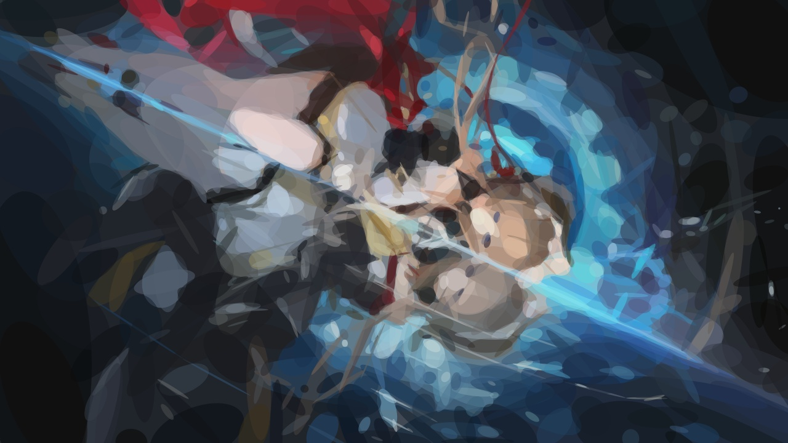
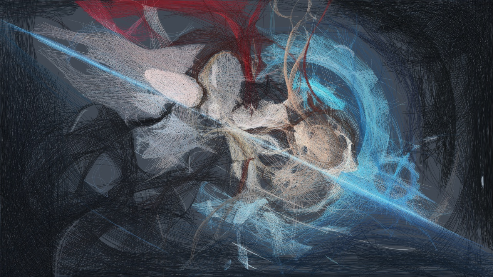
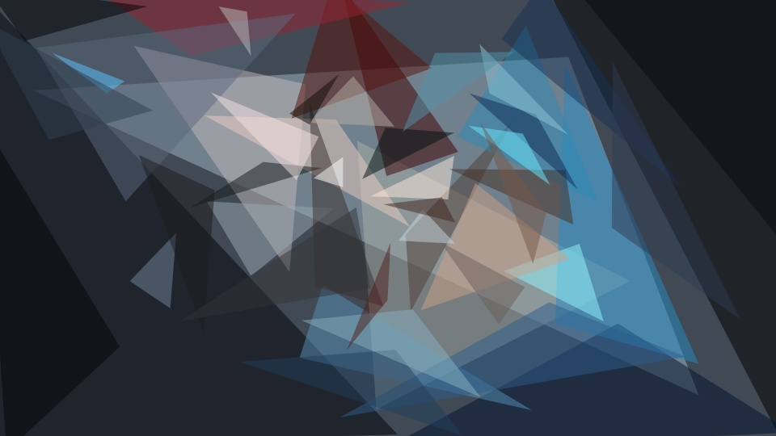

<div align="center">

# ◢ primitive-gpu

**Turn any image into a few thousand geometric shapes. The search runs on your NVIDIA GPU.**

[](LICENSE.md)
[](https://go.dev)
[](https://developer.nvidia.com/cuda-toolkit)
[](#install)

<table>
  <tr>
    <td align="center"><br><sub><b>Input</b> · 1920×1080</sub></td>
    <td align="center"><br><sub><b>1,000 triangles</b> · 2.7 s</sub></td>
  </tr>
</table>


<sub>300 triangles, drawn one at a time</sub>

</div>

---

A CUDA port of the search loop from [fogleman/primitive](https://github.com/fogleman/primitive). Each step tries thousands of random shapes, hill-climbs the best, and commits the winner. Here that loop runs in one persistent GPU kernel, and Go replays the winners with anti-aliasing and writes PNG, JPG, SVG or GIF.

## Contents

[Install](#install) · [Quick start](#quick-start) · [Command reference](#command-reference) · [Recipes](#recipes) · [Gallery](#gallery) · [Performance](#performance) · [Limits](#limits) · [Credits](#credits)

---

## Install

You need an NVIDIA GPU, the [CUDA Toolkit](https://developer.nvidia.com/cuda-toolkit), [Go](https://go.dev/dl/) and Visual Studio Build Tools (MSVC) on Windows.

```powershell
git clone https://github.com/Rcidshacker/primitive-gpu
cd primitive-gpu

cuda\build.bat                    # builds cuda\gpu_search.exe
go build -o primitive.exe .       # builds the front end
```

`cuda/build.bat` targets `sm_89` (RTX 40 series). Edit it for your card:

| GPU | `-arch` |
|---|---|
| RTX 20 series | `sm_75` |
| RTX 30 series | `sm_86` |
| RTX 40 series | `sm_89` |

> Linux is untested. The same `nvcc -arch=sm_89 -O2 --fmad=false cuda/gpu_search.cu -o cuda/gpu_search` line should work.

## Quick start

```powershell
.\primitive.exe -gpu cuda\gpu_search.exe -i photo.jpg -o out.png -n 500
```

That is 500 triangles, searched on the GPU, saved to `out.png`. Every example below adds `-gpu cuda\gpu_search.exe`; leave it out and the same command runs on the CPU.

---

## Command reference

```
primitive.exe  -i <input>  -o <output>  -n <count>  [options]
```

### Required

| Flag | What it does |
|---|---|
| `-i path` | Input image. PNG, JPG, GIF or WebP. `-i -` reads from stdin. |
| `-o path` | Output file. Repeat `-o` for several outputs at once. |
| `-n count` | Number of shapes to draw. |

### Shapes · `-m`

| `-m` | Shape | Good for |
|---:|---|---|
| `1` | Triangle (default) | The classic low-poly look |
| `2` | Rectangle | Mosaic, pixel-art feel |
| `3` | Ellipse | Soft, painterly blobs |
| `4` | Circle | Bubbly, pointillist |
| `5` | Rotated rectangle | Brush strokes |
| `6` | Bezier curve | Line-art, needs different settings (see [Recipes](#recipes)) |
| `7` | Rotated ellipse | Smoother than circles, still compact |
| `8` | Polygon (convex quad) | Faceted, glassy |
| `0` | Combo of all of the above | Varied texture |

### Quality

| Flag | Default | What it does |
|---|---:|---|
| `-a n` | `128` | Shape opacity, 1 to 255. `0` lets the search pick the best opacity for each shape. |
| `-rep n` | `0` | After each shape, add `n` more nearby shapes using a lighter search. More detail per second, less variety. |
| `-bg hex` | image average | Background colour, e.g. `-bg 000000`. |

### Resolution

| Flag | Default | What it does |
|---|---:|---|
| `-r n` | `256` | The input is shrunk to `n` px on its long side **for the search**. Bigger is more accurate and slower. `0` keeps the full size. |
| `-s n` | `1024` | Output size in px on the long side. Independent of `-r`, so a 768 px search can be rendered at 4K. |

### Output formats

The format comes from the file extension.

| Output | Command |
|---|---|
| PNG | `-o out.png` |
| JPG | `-o out.jpg` |
| SVG (vector, scales forever) | `-o out.svg` |
| Animated GIF | `-o out.gif` |
| SVG to stdout | `-o -` |
| Every frame | `-o frame_%04d.png` |
| Every 10th frame | `-o frame_%04d.png -nth 10` |
| Several at once | `-o a.png -o a.svg -o a.gif` |

### Mixing shapes in one run

`-m`, `-a` and `-rep` apply to the next `-n` that follows them, so you can chain stages:

```powershell
# 100 big triangles, then 400 circles on top, then 1000 small rectangles
.\primitive.exe -gpu cuda\gpu_search.exe -i in.jpg -o out.png `
    -m 1 -n 100  -m 4 -n 400  -m 2 -n 1000
```

With a single `-n`, the flag order does not matter.

### GPU, CPU and diagnostics

| Flag | What it does |
|---|---|
| `-gpu path` | Search on the GPU using this `gpu_search.exe`. Works for all nine shape modes and `-rep`. |
| `-j n` | CPU worker count. Only matters without `-gpu`. Default is all cores. |
| `-v` | Print the score after every shape. |
| `-vv` | Very verbose. |
| `-trace file` | Write per-step timing as JSONL. Summarise with `python tools/analyze_trace.py file`. |

---

## Recipes

Copy, paste, change the filenames.

<details open>
<summary><b>Fast preview</b> · 5 seconds</summary>

```powershell
.\primitive.exe -gpu cuda\gpu_search.exe -i in.jpg -o out.png -n 200 -r 256 -s 1024
```
</details>

<details>
<summary><b>Wallpaper</b> · 1080p input, sharp 4K output</summary>

```powershell
.\primitive.exe -gpu cuda\gpu_search.exe -i in.jpg -o out.png -n 2000 -m 1 -r 768 -s 3840
```
Search stays at 768 px, so this is barely slower than a 1080p render.
</details>

<details>
<summary><b>Print-size vector</b> · SVG</summary>

```powershell
.\primitive.exe -gpu cuda\gpu_search.exe -i in.jpg -o out.svg -n 1500 -m 4 -r 768
```
</details>

<details>
<summary><b>Phone portrait</b> · keeps the aspect ratio</summary>

```powershell
.\primitive.exe -gpu cuda\gpu_search.exe -i portrait.jpg -o out.png -n 5000 -m 1 -r 768 -s 1599
```
</details>

<details>
<summary><b>Beziers</b> · thin strokes need a different recipe</summary>

```powershell
.\primitive.exe -gpu cuda\gpu_search.exe -i in.jpg -o out.png -m 6 -a 0 -n 200 -rep 19 -r 768
```
Beziers are 0.5 px strokes, so one per step adds very little. `-rep 19` adds 19 more per step and `-a 0` lets the search pick opacity.
</details>

<details>
<summary><b>Animated GIF</b> · watch it draw</summary>

```powershell
.\primitive.exe -gpu cuda\gpu_search.exe -i in.jpg -o draw.gif -n 300 -m 1 -r 512 -s 640
```
Uses ImageMagick if it is on `PATH`, otherwise a built-in encoder.
</details>

<details>
<summary><b>Frame sequence for video</b></summary>

```powershell
.\primitive.exe -gpu cuda\gpu_search.exe -i in.jpg -o frames\f_%04d.png -nth 5 -n 600
ffmpeg -framerate 30 -i frames\f_%04d.png -pix_fmt yuv420p draw.mp4
```
</details>

<details>
<summary><b>Every image in a folder</b></summary>

```powershell
mkdir out
Get-ChildItem *.jpg | ForEach-Object {
  .\primitive.exe -gpu cuda\gpu_search.exe -i $_.FullName -o "out\$($_.BaseName).png" -n 500 -m 1
}
```
</details>

<details>
<summary><b>Very large input</b> · 4K or 8K</summary>

```powershell
.\primitive.exe -gpu cuda\gpu_search.exe -i huge.png -o out.png -n 60 -r 0 -s 7680
```
`-r 0` searches at full resolution. The GPU does this in seconds where the CPU takes minutes, and the output can go up to 8K.
</details>

---

## Gallery

One input, nine ways. All searched at 768 px, 1,000 shapes (beziers: see recipe), rendered at 1280 px.

<table>
  <tr>
    <td align="center"><br><sub><b>Circles</b> · <code>-m 4</code></sub></td>
    <td align="center"><br><sub><b>Rotated ellipses</b> · <code>-m 7</code></sub></td>
  </tr>
  <tr>
    <td align="center"><br><sub><b>Rotated rectangles</b> · <code>-m 5</code></sub></td>
    <td align="center"><br><sub><b>Polygons</b> · <code>-m 8</code></sub></td>
  </tr>
  <tr>
    <td align="center"><br><sub><b>Combo</b> · <code>-m 0</code></sub></td>
    <td align="center"><br><sub><b>Beziers</b> · <code>-m 6 -a 0 -rep 19</code></sub></td>
  </tr>
</table>

**More shapes, more detail**

<table>
  <tr>
    <td align="center"><br><sub><b>50</b></sub></td>
    <td align="center"><br><sub><b>200</b></sub></td>
  </tr>
  <tr>
    <td align="center"><br><sub><b>1,000</b></sub></td>
    <td align="center"><br><sub><b>5,000</b></sub></td>
  </tr>
</table>

<sub>Sample image is third-party artwork, shown only to demonstrate the tool. Use your own.</sub>

---

## Performance

Wall time for the sample above (1920×1080 input, 768 px search) on an RTX 4050 laptop, with other apps running. Single runs, so rough.

| Run | Time | RMSE (lower is better) |
|---|---:|---:|
| 200 triangles | 1.4 s | 0.069 |
| 1,000 triangles | 2.7 s | 0.046 |
| 5,000 triangles | 8.3 s | 0.028 |
| 1,000 circles | 2.6 s | 0.056 |
| 1,000 rotated ellipses | 3.0 s | 0.048 |
| 1,000 rotated rectangles | 2.1 s | 0.049 |
| 1,000 polygons | 5.7 s | 0.045 |
| 1,000 combo | 4.5 s | 0.046 |
| 200 beziers × 20 (`-rep 19`) | 32 s | 0.066 |

Against the original CPU search on the same machine: triangles run about 16× faster per step at 256 px (1.1 ms vs 17 to 19 ms), other shapes 6× to 24× end to end, and a 4K input with 20 shapes takes 9.4 s instead of 364 s.

## How it works

1. Go loads the image and starts the GPU searcher with the current canvas.
2. For every step, 16 groups of warps each try 1,000 random shapes, then hill-climb the best one.
3. Each candidate is scored on its own pixels only, with a closed-form best colour. The best candidate across groups wins and is drawn onto the canvas on the device.
4. Go replays the winning shapes with anti-aliasing at the output size and writes the file.

The whole loop stays on the GPU between steps, so there is no per-step host round trip.

## Limits

- Polygon mode searches convex quads only.
- The GPU scores hard edges while Go renders anti-aliased, so the final score can differ slightly for modes 5, 7 and 8.
- A shape cannot be taller than 512 rows at the search resolution. Taller candidates are rejected.
- Runs are not bit-for-bit repeatable (atomics and an async hill-climb).
- Needs an NVIDIA GPU. No AMD or Apple support.

## Credits

Algorithm and CPU implementation by [Michael Fogleman](https://github.com/fogleman/primitive). CUDA port, GPU shape modes and tooling by [Rcidshacker](https://github.com/Rcidshacker). MIT licensed, see [LICENSE.md](LICENSE.md).
